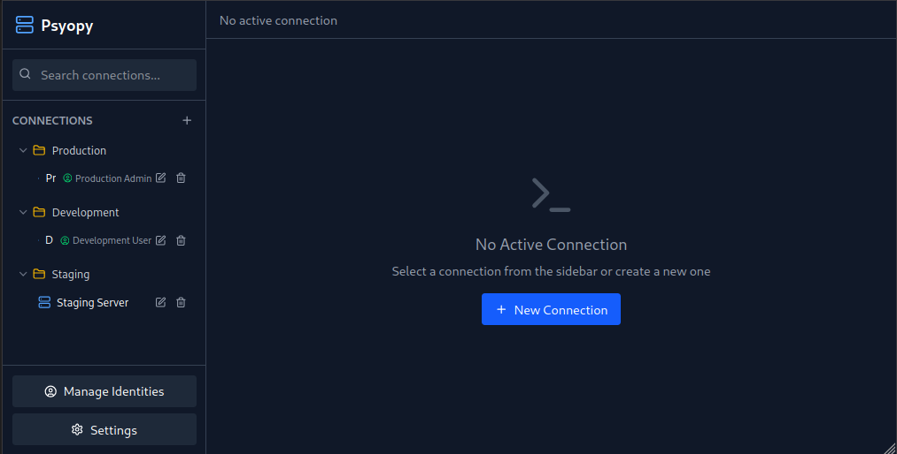

# psyopy

**psyopy** is an open-source SSH management application designed to simplify the process of connecting to and managing your servers.
Inspired by the functionality of Termius, manssh provides a user-friendly interface and powerful features to help you manage your SSH connections efficiently.

## 🚧 ***UNDER CONSTRUCTION*** 🚧
This project is in a very early stage of development and is not yet ready for use. Please check back later for updates.

## Screenshots

## Features

- 🚧 **Server Management**: Easily add, edit, and delete server configurations.
- 🚧 **SSH Connections**: Connect to your servers securely via SSH with a single click.
- 🚧 **Data Export/Import**: Seamlessly export and import your server configurations for easy backup and migration.
- 🚧 **Account Sync**: Sync your data across multiple devices by creating an account.
- 🚧 **Team Collaboration**: Share your server configurations with teammates to enhance collaboration.
- 🚧 **Cross-Platform Support**: Available on multiple platforms, including Windows, macOS, and Linux.

## Contributing
Please take a look at the [project's kanban board](https://github.com/users/ArjixWasTaken/projects/3), to see what is being worked on, and what you can help do.

## License

This project is licensed under the MIT License. See the [LICENSE](./LICENSE) file for more details.

## Acknowledgments

- Inspired by Termius and other SSH management tools.
- Thanks to all contributors and the open-source community for their support.
